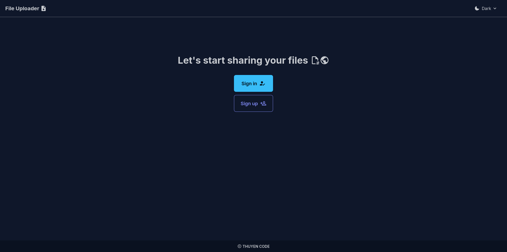
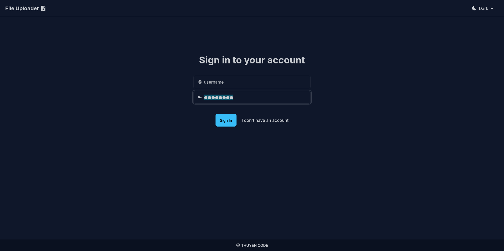
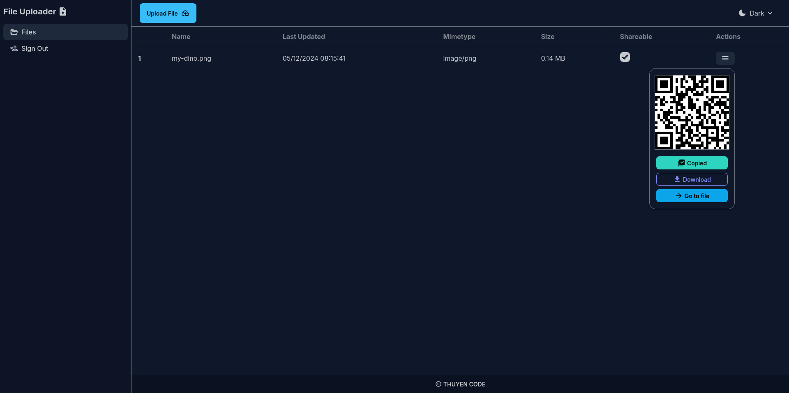
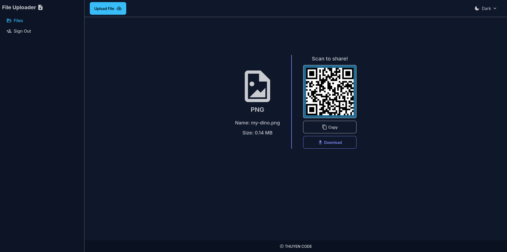
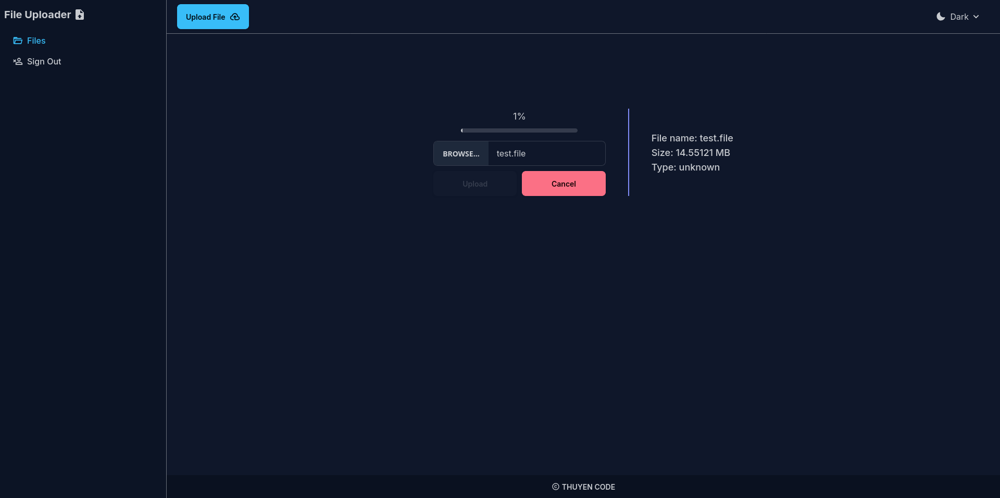

# Project: File Uploader

[More details information here.](https://www.theodinproject.com/lessons/nodejs-file-uploader)

👉 [Check the screenshots of this project](#screenshots) 📸

**Tech stacks:**

|                                                                                                                                             Frontend                                                                                                                                             |                                                                                              Backend                                                                                              |
| :----------------------------------------------------------------------------------------------------------------------------------------------------------------------------------------------------------------------------------------------------------------------------------------------: | :-----------------------------------------------------------------------------------------------------------------------------------------------------------------------------------------------: |
| [](https://github.com/LelouchFR/skill-icons) <br /> and [Tanstack Router](https://tanstack.com/router/latest), [Axios](https://axios-http.com), [Valibot](https://valibot.dev) | [](https://github.com/LelouchFR/skill-icons) <br /> and [Valibot](https://valibot.dev) |

## Getting started

### 1. Installing dependencies

This project use some of Bun APIs so make sure [Bun is installed](https://bun.sh).

Then process to install dependencies:

```sh
bun i
```

### 2. Setting-up the database

Your need to install PostgreSQL first using your OS's package manager, an installer file or using Docker (recommended).

Configure the host address, port number, username, password, a database according to [`.env.example`](./.env.example).

Copy the file [`.env.example`](./.env.example) into `.env.production.local` and `.env.development.local` and edit the env variables' values.

Then use one of these commands to migrate the database:

```text
# If you're in development mode
bun prisma:dev:migrate

# If you're in production mode
bun prisma:dev:migrate
```

## 3. Running the project

First, install all the dependencies:

To run the dev server:

```sh
bun dev
```

To bundle and run the project in production:

```sh
bun run build
bun start
```

## Screenshots

|  |
| :----------------------------------: |
|              Home page               |

|  |
| :-----------------------------------: |
|             Sign-in page              |

|  |
| :------------------------------------: |
|               Files page               |

|  |
| :---------------------------------------------: |
|                File sharing page                |

|  |
| :------------------------------------------------: |
|                 File uploader page                 |
